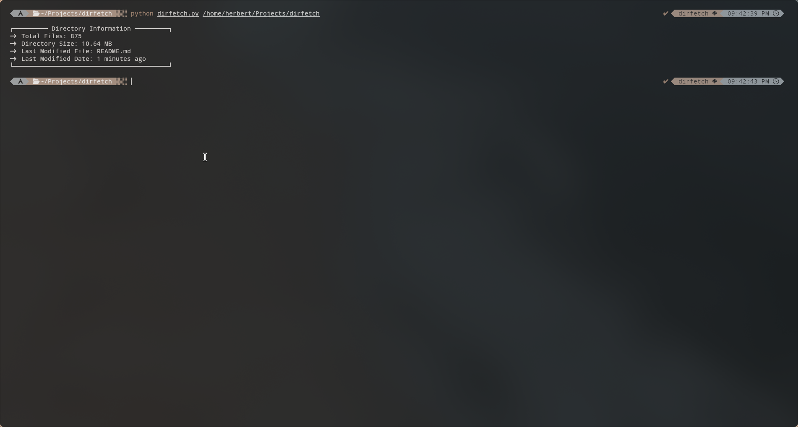
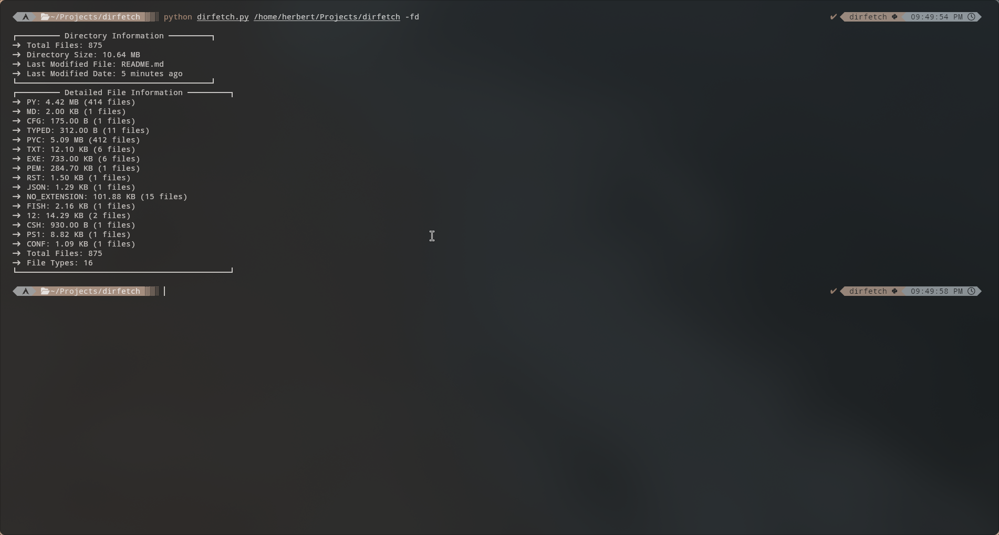

# 📂 DirFetch

`DirFetch` is a customizable command-line tool to gather and display detailed information about directories. Inspired by `neofetch`, it provides insights such as file counts, sizes, last modification dates, and more, all formatted according to user-configurable settings.

---

## 🌟 Features

-   **Detailed Directory Stats:** Displays total files, directory size, and more.
-   **Customizable Display:** Configure which information to show via the `dirfetch.conf` file.
-   **Relative & Absolute Dates:** Choose between relative ("5 days ago") or absolute dates ("2023-12-03").
-   **Detailed File Breakdown:** View counts and sizes by file type with optional `--file-details` mode.

---

## 🚀 Installation

### From GitHub

Coming soon.

### On Arch Linux

Coming soon to `pacman`.

---

## 🛠️ Usage

### Basic Usage

```bash
python dirfetch.py [directory]
```

### Detailed File Information

```bash
python dirfetch.py [directory] --file-details
```

### Configuration

Edit the `dirfetch.conf` file to customize the output. Example:

```plaintext
# Display Settings
show_total_files="on"
show_directory_size="on"
show_last_modified="on"
show_last_modified_date="on"

# Custom Messages
total_files_message="  Total Files: {}"
directory_size_message="  Directory Size: {}"
```

---

## 📸 Example Output

### Basic View:



### Detailed View:



---

## 🔧 Configuration Options

-   **show_total_files**: Show total file count.
-   **show_directory_size**: Display total directory size.
-   **date_display_mode**: Options: `auto`, `relative_only`, `absolute_only`.
-   **total_files_message**: Customizable message for file count.

Refer to the provided `dirfetch.conf` for a full list of options.

---

## 🤝 Contributing

Contributions are welcome! Please submit issues or pull requests to the [repository](https://github.com/herb-chan/dirfetch).

---

## 📜 License

This project is licensed under the MIT License.
